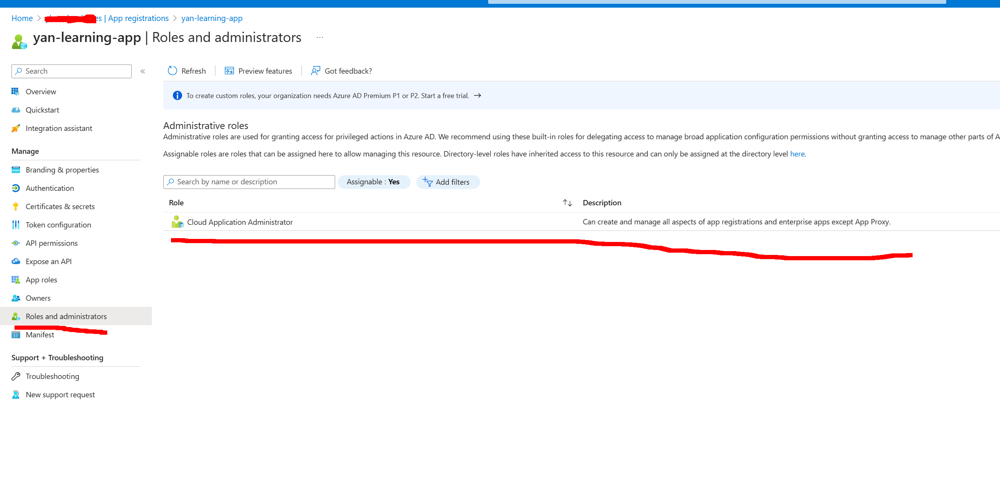

https://learn.microsoft.com/en-us/azure/key-vault/secrets/quick-create-net?tabs=azure-cli

A simple program that reads secrets from Azure Key Vault using the Azure.Identity library.

# Authentication

We use `new DefaultAzureCredential()` to authenticate the app to Azure Key Vault.
https://learn.microsoft.com/en-us/java/api/com.azure.identity.defaultazurecredential?view=azure-java-stable

Under the hood, it uses [EnvironmentCredential](https://learn.microsoft.com/en-us/dotnet/api/azure.identity.environmentcredential?view=azure-dotnet).

You need to setup environment variables:
```
AZURE_TENANT_ID
AZURE_CLIENT_ID
AZURE_CLIENT_SECRET
```


# Create an application in Azure.
1) Go to Azure Active Directory -> App registrations -> New registration.


Redirect URI can be empty.

2) Add role to your application.


3) Configure KeyVault to allow access to your application.
Go to your key vault -> Access policies -> Add Access Policy.
