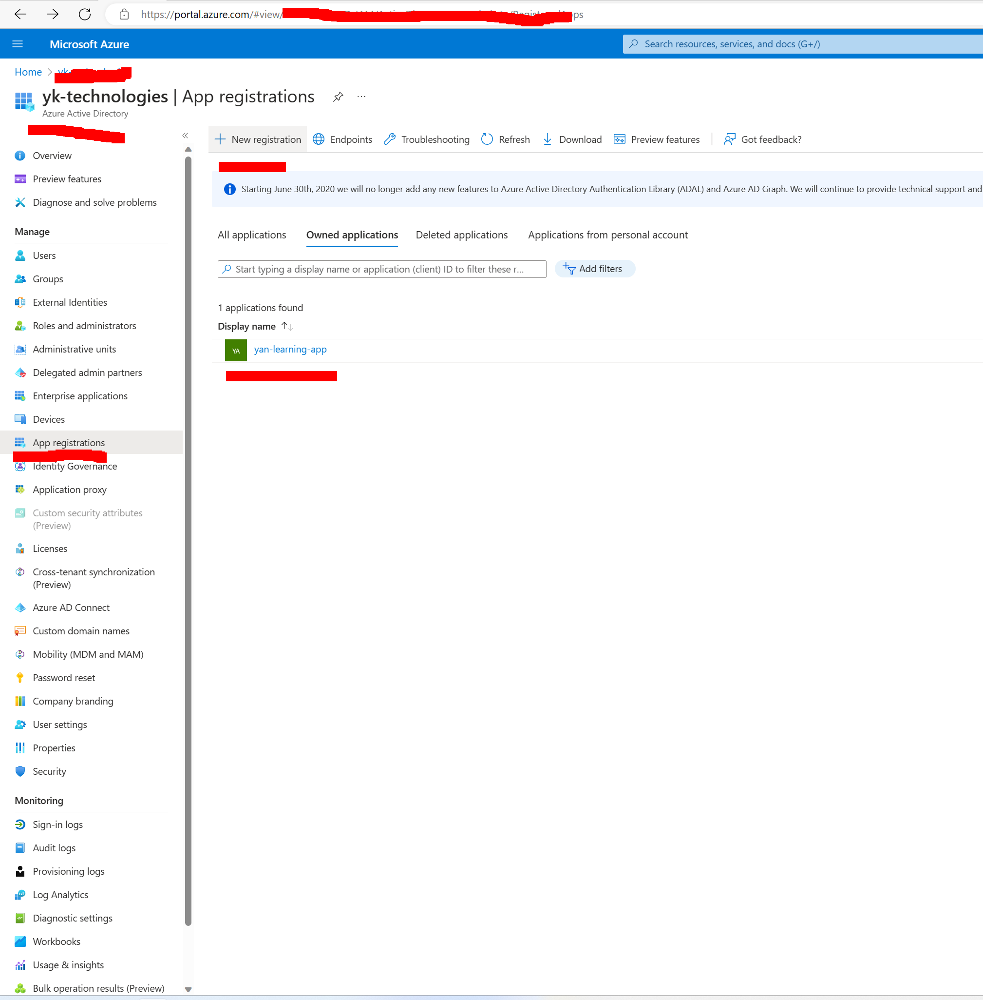
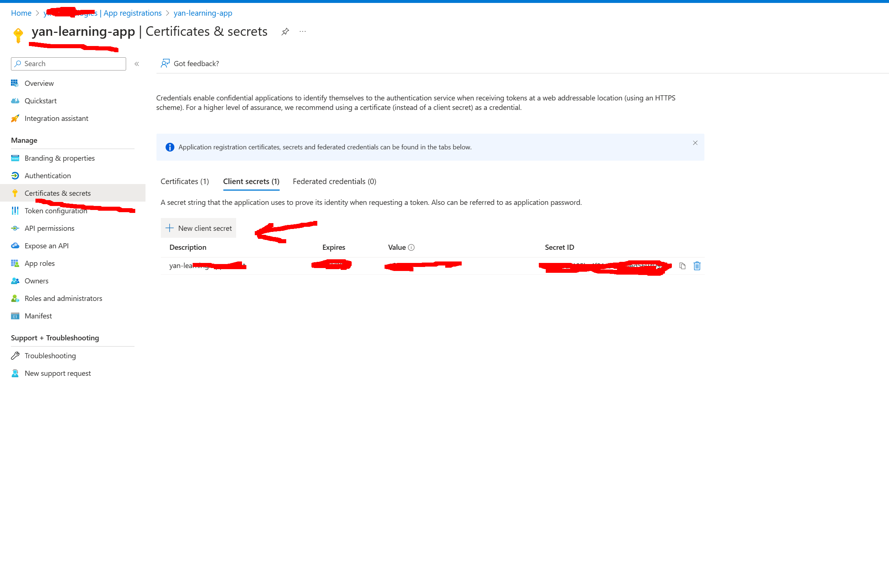
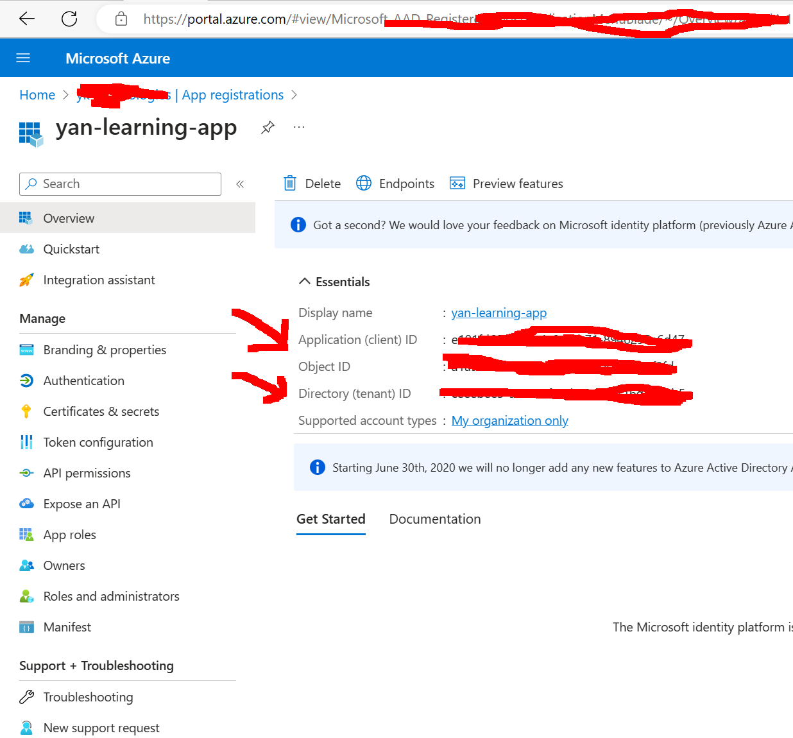
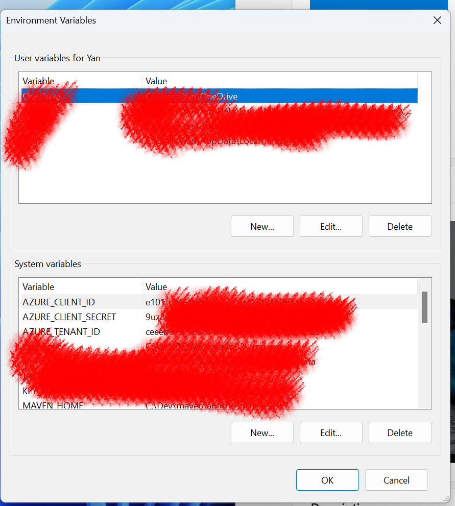
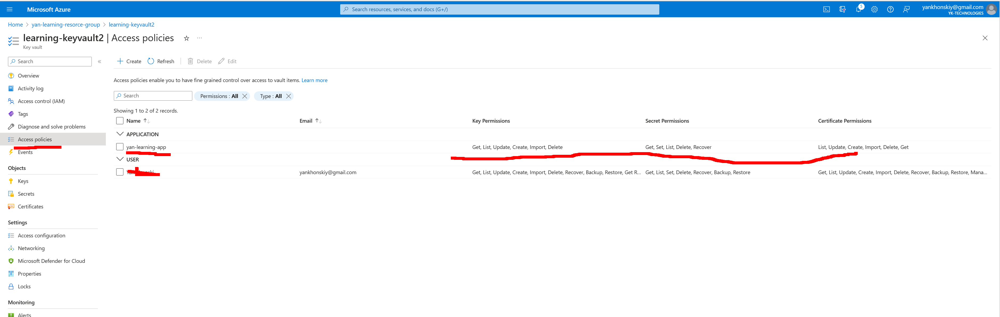

A simple program that reads secrets from Azure Key Vault using the Azure.Identity library.
Run `Program.cs` to see it in action.
You may want to initialization the key vault with values. Uncomment the code that populates the keyVault and set `enabled=true`.


# Run it as Azure Powershell CLI.
Make sure that Azure PowerShell is selected. Login using `az login`.

This will select all the secrets:
```powershell
Get-AzKeyVaultSecret -VaultName "learning-keyvault2"
```

Secrets that have a pattern name
```powershell
Get-AzKeyVaultSecret -VaultName "learning-keyvault2" -Name '*super*'
```

To select a specific secret:
```powershell
Get-AzKeyVaultSecret -VaultName "learning-keyvault2" -Name 'Secret1'
```


To see the value
```powershell
Get-AzKeyVaultSecret -VaultName "learning-keyvault2" -Name 'Secret1' -AsPlainText
```

Alternatively, you can see the value:
```powershell
az keyvault secret show --name "Secret1" --vault-name "learning-keyvault2" --query "value"
```


# Authentication

We use [`DefaultAzureCredential()`](https://learn.microsoft.com/en-us/dotnet/api/azure.identity.defaultazurecredential?view=azure-dotnet) to authenticate the app to Azure Key Vault.

Under the hood, it uses [EnvironmentCredential](https://learn.microsoft.com/en-us/dotnet/api/azure.identity.environmentcredential?view=azure-dotnet).


### Create an application in Azure.
Go to Azure Active Directory -> App registrations -> New registration.

<details>
<summary>click here to see screen "Create new registration"</summary>



</details>

Redirect URI can be empty.

### Add secret to your application.

<details>

<summary>click here to see screen "Application secret screen"</summary>



</details>

Copy the secret value to enviromet variable `AZURE_CLIENT_SECRET`.

> [WARN] Do not leave that screen yet, copy the secret into environment variable `AZURE_CLIENT_SECRET`.
After you leave the secret page, you won't be able to copy its value, so you will have to create a new secret.

### Check app credentials to set up the local environment variables.

<details>

<summary>click here to see screen "Application credentials screen"</summary>



</details>

### You need to setup environment variables:
```
AZURE_TENANT_ID
AZURE_CLIENT_ID
AZURE_CLIENT_SECRET
```

<details>

<summary>click here to see screen "Environment variuables screen"</summary>



</details>

### Configure KeyVault to allow access to your application.
Go to your key vault -> Access policies -> Add Access Policy.

<details>

<summary>click here to see screen "Add new access policy"</summary>



</details>


# Links:

https://learn.microsoft.com/en-us/azure/key-vault/secrets/quick-create-net?tabs=azure-cli

https://stackoverflow.com/questions/75523762/how-to-use-azure-key-vault-from-localhost-using-vs2022